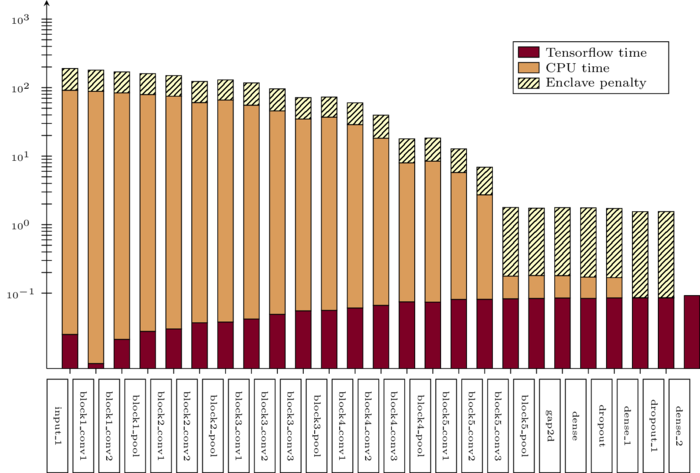
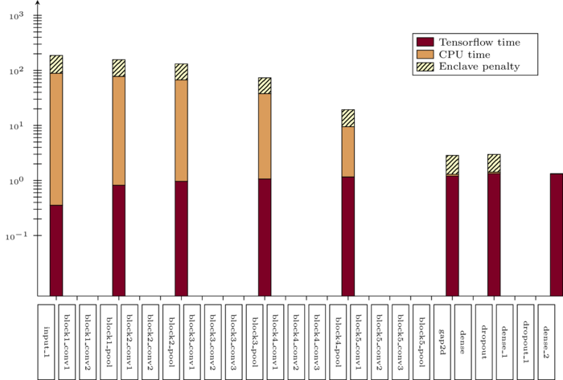

# Table of Contents

1.  [NN SGX](#org689d77a)
    1.  [People](#org87d321c)
    2.  [Datasets](#org84331a5)
        1.  [Add dataset links](#org15996c2)
    3.  [Current Status](#org450843a)
        1.  [Enclave Implementation](#org569c2fc)
        2.  [Model Training](#org1184e48)
    4.  [Timing measurements](#orgf807416)
        1.  [First Attempt](#org9dea7d6)
        2.  [Second Attempt](#orgfe948cd)
    5.  [Related Work](#org9493915)
2.  [README](#orgfeadc6b)
    1.  [Setting up a testing environment](#org061f2a7)
    2.  [Training a model](#orgae159e6)
    3.  [Extracting the enclave](#orgd03c6b7)
    4.  [Compiling the enclave](#org7028072)
    5.  [Running the enclave](#orge5b7caf)
        1.  [Setting up `LD_LIBRARY_PATH`](#orgbe300de)
        2.  [Evaluating models](#org780de32)
    6.  [Under the hood](#orga13fb46)

# NN SGX

Running some parts or all of a CNN inside the trusted enclave to reduce leakage and protect against model stealing.
We hope to make this as robust against model stealing as online oracles.

## People

RBO, CPA, ASC

## Datasets

Image recognition tasks as well as text classification tasks are used for testing.
The image recognition tasks are MNIST using a small CNN, and MIT67 using a pretrained VGG16 network as feature extractor.
I fixed the weights for the VGG16 feature extractor during training of the final classification 
For the text classfication we used IMDB review sentiment classification using MLPs, and Rotten Tomatoes review sentiment classification using CNNs on sequences.
The code for these is taken from [here](https://github.com/google/eng-edu/tree/master/ml/guides/text_classification).
This choice of datasets gives us reasonably large CNNs for multiple tasks and media types, as well as smaller models for a task of both kinds.

All datasets are stored in `data`.

### TODO Add dataset links

## Current Status

The technical part of this research project is mostly done, and only few cleanup jobs remain.
My current focus will be on the writeup, and finding a clear narrative for my reasoning.

### Enclave Implementation

Implementing all TF operations present in the used models is finished.
The results are (mostly) consistent with the original TF models, which indicates a correct implementation and thus meaningful timing measurements.
The few different results are most likely due to rounding differences on different hardware platforms, and algorithmic choices (different order of operations).
Please note that differences do not necessarily mean errors.
We have observed cases where the original result was a misclassification, but the enclave variant was not.

1.  TODO Rigorously measure and classify label differences between TF, native and enclave

### Model Training

As I lack the required expertise in the area of neural net design, I tried to use existing models where I could.
The model for MNIST is taken from [this Keras example](https://keras.io/examples/mnist_cnn/).
I could not find an architecture using VGG16 as a feature extractor, and for some reason (probably due to a bug somewhere) using any version of ResNet does not yield better results than random choice.
This is true for any model using a [BatchNormalization layer](https://www.tensorflow.org/api_docs/python/tf/keras/layers/BatchNormalization?version=stable), which lead me to the conclusion that this is an implementation error.
Due to this I trained a model using VGG16 as a feature extractor until it gave reasonably good results (between 55% and 60% validation accuracy for 67 classes).
Both models for text classification are taken from [this](https://github.com/google/eng-edu/tree/master/ml/guides/text_classification) machine learning tutorial by Google.
For our tests the models do not have to perform close to the state of the art, only well enough that we can rule out the possibility of trivial weights with confidence, as these could impact our performance measurements in unforeseen ways.

## Timing measurements

All code is compiled for SGX in HWPRERERELEASE mode

### First Attempt

1.  Rotten Tomatoes

    The times are averaged over 50 batches.
    Enclave setup is not included in the times.
    The first run is discarded to also filter out TF-GPU setup time.
    
    A summary of the model is as follows:
    
        embedding:               	(None, 49, 200)
        dropout:                 	(None, 49, 200)
        separable_conv1d:        	(None, 49, 64)
        separable_conv1d_1:      	(None, 49, 64)
        max_pooling1d:           	(None, 16, 64)
        separable_conv1d_2:      	(None, 16, 128)
        separable_conv1d_3:      	(None, 16, 128)
        global_average_pooling1d:	(None, 128)
        dropout_1:               	(None, 128)
        dense:                   	(None, 5)
    
    The column specifies the number of layers **from the back** that are put in the enclave.
    
    1.  Tensorflow-GPU Times
    
        <table border="2" cellspacing="0" cellpadding="6" rules="groups" frame="hsides">
        
        
        <colgroup>
        <col  class="org-right" />
        
        <col  class="org-right" />
        
        <col  class="org-right" />
        
        <col  class="org-right" />
        
        <col  class="org-right" />
        
        <col  class="org-right" />
        
        <col  class="org-right" />
        
        <col  class="org-right" />
        
        <col  class="org-right" />
        </colgroup>
        <thead>
        <tr>
        <th scope="col" class="org-right">#(Batch)\Layers</th>
        <th scope="col" class="org-right">1</th>
        <th scope="col" class="org-right">2</th>
        <th scope="col" class="org-right">3</th>
        <th scope="col" class="org-right">4</th>
        <th scope="col" class="org-right">5</th>
        <th scope="col" class="org-right">6</th>
        <th scope="col" class="org-right">7</th>
        <th scope="col" class="org-right">8</th>
        </tr>
        </thead>
        
        <tbody>
        <tr>
        <td class="org-right">1</td>
        <td class="org-right">0.021391</td>
        <td class="org-right">0.021506</td>
        <td class="org-right">0.021263</td>
        <td class="org-right">0.021504</td>
        <td class="org-right">0.021386</td>
        <td class="org-right">0.022156</td>
        <td class="org-right">0.022420</td>
        <td class="org-right">0.021786</td>
        </tr>
        
        
        <tr>
        <td class="org-right">5</td>
        <td class="org-right">0.021275</td>
        <td class="org-right">0.021364</td>
        <td class="org-right">0.021191</td>
        <td class="org-right">0.022280</td>
        <td class="org-right">0.021514</td>
        <td class="org-right">0.022063</td>
        <td class="org-right">0.020909</td>
        <td class="org-right">0.021172</td>
        </tr>
        
        
        <tr>
        <td class="org-right">10</td>
        <td class="org-right">0.021836</td>
        <td class="org-right">0.021329</td>
        <td class="org-right">0.021640</td>
        <td class="org-right">0.021221</td>
        <td class="org-right">0.021072</td>
        <td class="org-right">0.021168</td>
        <td class="org-right">0.021441</td>
        <td class="org-right">0.021476</td>
        </tr>
        
        
        <tr>
        <td class="org-right">50</td>
        <td class="org-right">0.010124</td>
        <td class="org-right">0.028781</td>
        <td class="org-right">0.030833</td>
        <td class="org-right">0.026013</td>
        <td class="org-right">0.025481</td>
        <td class="org-right">0.025112</td>
        <td class="org-right">0.024917</td>
        <td class="org-right">0.025178</td>
        </tr>
        
        
        <tr>
        <td class="org-right">100</td>
        <td class="org-right">0.043587</td>
        <td class="org-right">0.044060</td>
        <td class="org-right">0.045346</td>
        <td class="org-right">0.031918</td>
        <td class="org-right">0.031637</td>
        <td class="org-right">0.031476</td>
        <td class="org-right">0.031207</td>
        <td class="org-right">0.031222</td>
        </tr>
        
        
        <tr>
        <td class="org-right">500</td>
        <td class="org-right">0.110506</td>
        <td class="org-right">0.107064</td>
        <td class="org-right">0.101755</td>
        <td class="org-right">0.066747</td>
        <td class="org-right">0.069347</td>
        <td class="org-right">0.069550</td>
        <td class="org-right">0.068083</td>
        <td class="org-right">0.071315</td>
        </tr>
        
        
        <tr>
        <td class="org-right">1000</td>
        <td class="org-right">0.188149</td>
        <td class="org-right">0.199242</td>
        <td class="org-right">0.205119</td>
        <td class="org-right">0.153562</td>
        <td class="org-right">0.148908</td>
        <td class="org-right">0.150407</td>
        <td class="org-right">0.140155</td>
        <td class="org-right">0.138775</td>
        </tr>
        
        
        <tr>
        <td class="org-right">5000</td>
        <td class="org-right">1.206407</td>
        <td class="org-right">1.155464</td>
        <td class="org-right">1.180732</td>
        <td class="org-right">1.104479</td>
        <td class="org-right">1.016594</td>
        <td class="org-right">1.103854</td>
        <td class="org-right">1.065218</td>
        <td class="org-right">0.997463</td>
        </tr>
        
        
        <tr>
        <td class="org-right">7500</td>
        <td class="org-right">1.739533</td>
        <td class="org-right">1.722203</td>
        <td class="org-right">1.664009</td>
        <td class="org-right">1.713971</td>
        <td class="org-right">1.647305</td>
        <td class="org-right">1.559547</td>
        <td class="org-right">1.509747</td>
        <td class="org-right">1.509626</td>
        </tr>
        
        
        <tr>
        <td class="org-right">10000</td>
        <td class="org-right">2.001191</td>
        <td class="org-right">2.371181</td>
        <td class="org-right">2.288010</td>
        <td class="org-right">2.167776</td>
        <td class="org-right">2.171341</td>
        <td class="org-right">2.158835</td>
        <td class="org-right">2.139454</td>
        <td class="org-right">2.277547</td>
        </tr>
        </tbody>
        </table>
    
    2.  Enclave Times
    
        <table border="2" cellspacing="0" cellpadding="6" rules="groups" frame="hsides">
        
        
        <colgroup>
        <col  class="org-right" />
        
        <col  class="org-right" />
        
        <col  class="org-right" />
        
        <col  class="org-right" />
        
        <col  class="org-right" />
        
        <col  class="org-right" />
        
        <col  class="org-right" />
        
        <col  class="org-right" />
        
        <col  class="org-right" />
        </colgroup>
        <thead>
        <tr>
        <th scope="col" class="org-right">#(Batch)\Layers</th>
        <th scope="col" class="org-right">1</th>
        <th scope="col" class="org-right">2</th>
        <th scope="col" class="org-right">3</th>
        <th scope="col" class="org-right">4</th>
        <th scope="col" class="org-right">5</th>
        <th scope="col" class="org-right">6</th>
        <th scope="col" class="org-right">7</th>
        <th scope="col" class="org-right">8</th>
        </tr>
        </thead>
        
        <tbody>
        <tr>
        <td class="org-right">1</td>
        <td class="org-right">0.004030</td>
        <td class="org-right">0.004101</td>
        <td class="org-right">0.003948</td>
        <td class="org-right">0.007372</td>
        <td class="org-right">0.008193</td>
        <td class="org-right">0.008101</td>
        <td class="org-right">0.010586</td>
        <td class="org-right">0.017241</td>
        </tr>
        
        
        <tr>
        <td class="org-right">5</td>
        <td class="org-right">0.004136</td>
        <td class="org-right">0.004141</td>
        <td class="org-right">0.004123</td>
        <td class="org-right">0.021474</td>
        <td class="org-right">0.025296</td>
        <td class="org-right">0.025948</td>
        <td class="org-right">0.035261</td>
        <td class="org-right">0.066643</td>
        </tr>
        
        
        <tr>
        <td class="org-right">10</td>
        <td class="org-right">0.004520</td>
        <td class="org-right">0.004509</td>
        <td class="org-right">0.004479</td>
        <td class="org-right">0.036173</td>
        <td class="org-right">0.045170</td>
        <td class="org-right">0.045452</td>
        <td class="org-right">0.065724</td>
        <td class="org-right">0.128432</td>
        </tr>
        
        
        <tr>
        <td class="org-right">50</td>
        <td class="org-right">0.032096</td>
        <td class="org-right">0.009325</td>
        <td class="org-right">0.010035</td>
        <td class="org-right">0.164765</td>
        <td class="org-right">0.208798</td>
        <td class="org-right">0.208383</td>
        <td class="org-right">0.307739</td>
        <td class="org-right">0.627604</td>
        </tr>
        
        
        <tr>
        <td class="org-right">100</td>
        <td class="org-right">0.018667</td>
        <td class="org-right">0.018899</td>
        <td class="org-right">0.021223</td>
        <td class="org-right">0.329236</td>
        <td class="org-right">0.415729</td>
        <td class="org-right">0.415255</td>
        <td class="org-right">0.614807</td>
        <td class="org-right">1.247830</td>
        </tr>
        
        
        <tr>
        <td class="org-right">500</td>
        <td class="org-right">0.158167</td>
        <td class="org-right">0.139720</td>
        <td class="org-right">0.154573</td>
        <td class="org-right">1.600334</td>
        <td class="org-right">2.074725</td>
        <td class="org-right">2.083692</td>
        <td class="org-right">3.058047</td>
        <td class="org-right">6.303066</td>
        </tr>
        
        
        <tr>
        <td class="org-right">1000</td>
        <td class="org-right">0.336998</td>
        <td class="org-right">0.339511</td>
        <td class="org-right">0.370344</td>
        <td class="org-right">3.205655</td>
        <td class="org-right">4.156700</td>
        <td class="org-right">4.118088</td>
        <td class="org-right">6.186466</td>
        <td class="org-right">12.533901</td>
        </tr>
        
        
        <tr>
        <td class="org-right">5000</td>
        <td class="org-right">1.822304</td>
        <td class="org-right">1.638312</td>
        <td class="org-right">1.880398</td>
        <td class="org-right">15.906983</td>
        <td class="org-right">20.669846</td>
        <td class="org-right">20.409218</td>
        <td class="org-right">30.551559</td>
        <td class="org-right">62.745630</td>
        </tr>
        
        
        <tr>
        <td class="org-right">7500</td>
        <td class="org-right">2.547575</td>
        <td class="org-right">2.434002</td>
        <td class="org-right">2.648802</td>
        <td class="org-right">23.779323</td>
        <td class="org-right">30.571529</td>
        <td class="org-right">30.915689</td>
        <td class="org-right">46.082133</td>
        <td class="org-right">93.974223</td>
        </tr>
        
        
        <tr>
        <td class="org-right">10000</td>
        <td class="org-right">2.731499</td>
        <td class="org-right">3.396491</td>
        <td class="org-right">3.452197</td>
        <td class="org-right">31.899413</td>
        <td class="org-right">41.893637</td>
        <td class="org-right">41.231440</td>
        <td class="org-right">61.369204</td>
        <td class="org-right">124.449159</td>
        </tr>
        </tbody>
        </table>

2.  MIT67

    The times are averaged over 50 batches.
    Enclave setup is not included in the times.
    The first run is discarded to also filter out TF-GPU setup time.
    
    A summary of the model is as follows:
    
        input_1:                 	[(None, 224, 224, 3)]
        block1_conv1:            	(None, 224, 224, 64)
        block1_conv2:            	(None, 224, 224, 64)
        block1_pool:             	(None, 112, 112, 64)
        block2_conv1:            	(None, 112, 112, 128)
        block2_conv2:            	(None, 112, 112, 128)
        block2_pool:             	(None, 56, 56, 128)
        block3_conv1:            	(None, 56, 56, 256)
        block3_conv2:            	(None, 56, 56, 256)
        block3_conv3:            	(None, 56, 56, 256)
        block3_pool:             	(None, 28, 28, 256)
        block4_conv1:            	(None, 28, 28, 512)
        block4_conv2:            	(None, 28, 28, 512)
        block4_conv3:            	(None, 28, 28, 512)
        block4_pool:             	(None, 14, 14, 512)
        block5_conv1:            	(None, 14, 14, 512)
        block5_conv2:            	(None, 14, 14, 512)
        block5_conv3:            	(None, 14, 14, 512)
        block5_pool:             	(None, 7, 7, 512)
        global_average_pooling2d:	(None, 512)
        dense:                   	(None, 2048)
        dropout:                 	(None, 2048)
        dense_1:                 	(None, 2048)
        dropout_1:               	(None, 2048)
        dense_2:                 	(None, 67)
    
    1.  Tensorflow-GPU Times
    
        <table border="2" cellspacing="0" cellpadding="6" rules="groups" frame="hsides">
        
        
        <colgroup>
        <col  class="org-right" />
        
        <col  class="org-right" />
        
        <col  class="org-right" />
        
        <col  class="org-right" />
        
        <col  class="org-right" />
        
        <col  class="org-right" />
        
        <col  class="org-right" />
        
        <col  class="org-right" />
        
        <col  class="org-right" />
        </colgroup>
        <thead>
        <tr>
        <th scope="col" class="org-right">#(Batch)\Layers</th>
        <th scope="col" class="org-right">1</th>
        <th scope="col" class="org-right">3</th>
        <th scope="col" class="org-right">5</th>
        <th scope="col" class="org-right">7</th>
        <th scope="col" class="org-right">8</th>
        <th scope="col" class="org-right">9</th>
        <th scope="col" class="org-right">10</th>
        <th scope="col" class="org-right">15</th>
        </tr>
        </thead>
        
        <tbody>
        <tr>
        <td class="org-right">1</td>
        <td class="org-right">0.025428</td>
        <td class="org-right">0.036029</td>
        <td class="org-right">0.048565</td>
        <td class="org-right">0.059587</td>
        <td class="org-right">0.063313</td>
        <td class="org-right">0.069026</td>
        <td class="org-right">0.071457</td>
        <td class="org-right">0.091238</td>
        </tr>
        
        
        <tr>
        <td class="org-right">2</td>
        <td class="org-right">&#xa0;</td>
        <td class="org-right">&#xa0;</td>
        <td class="org-right">&#xa0;</td>
        <td class="org-right">&#xa0;</td>
        <td class="org-right">&#xa0;</td>
        <td class="org-right">&#xa0;</td>
        <td class="org-right">&#xa0;</td>
        <td class="org-right">&#xa0;</td>
        </tr>
        
        
        <tr>
        <td class="org-right">3</td>
        <td class="org-right">0.025450</td>
        <td class="org-right">0.037214</td>
        <td class="org-right">0.051288</td>
        <td class="org-right">0.064751</td>
        <td class="org-right">0.070158</td>
        <td class="org-right">0.072505</td>
        <td class="org-right">0.077171</td>
        <td class="org-right">0.089956</td>
        </tr>
        
        
        <tr>
        <td class="org-right">4</td>
        <td class="org-right">&#xa0;</td>
        <td class="org-right">&#xa0;</td>
        <td class="org-right">&#xa0;</td>
        <td class="org-right">&#xa0;</td>
        <td class="org-right">&#xa0;</td>
        <td class="org-right">&#xa0;</td>
        <td class="org-right">&#xa0;</td>
        <td class="org-right">&#xa0;</td>
        </tr>
        
        
        <tr>
        <td class="org-right">5</td>
        <td class="org-right">0.025279</td>
        <td class="org-right">0.038138</td>
        <td class="org-right">0.052808</td>
        <td class="org-right">0.064366</td>
        <td class="org-right">0.071037</td>
        <td class="org-right">0.074503</td>
        <td class="org-right">0.077482</td>
        <td class="org-right">0.089345</td>
        </tr>
        
        
        <tr>
        <td class="org-right">6</td>
        <td class="org-right">&#xa0;</td>
        <td class="org-right">&#xa0;</td>
        <td class="org-right">&#xa0;</td>
        <td class="org-right">&#xa0;</td>
        <td class="org-right">&#xa0;</td>
        <td class="org-right">&#xa0;</td>
        <td class="org-right">&#xa0;</td>
        <td class="org-right">&#xa0;</td>
        </tr>
        
        
        <tr>
        <td class="org-right">7</td>
        <td class="org-right">&#xa0;</td>
        <td class="org-right">&#xa0;</td>
        <td class="org-right">&#xa0;</td>
        <td class="org-right">&#xa0;</td>
        <td class="org-right">&#xa0;</td>
        <td class="org-right">&#xa0;</td>
        <td class="org-right">&#xa0;</td>
        <td class="org-right">&#xa0;</td>
        </tr>
        
        
        <tr>
        <td class="org-right">8</td>
        <td class="org-right">&#xa0;</td>
        <td class="org-right">&#xa0;</td>
        <td class="org-right">&#xa0;</td>
        <td class="org-right">&#xa0;</td>
        <td class="org-right">&#xa0;</td>
        <td class="org-right">&#xa0;</td>
        <td class="org-right">&#xa0;</td>
        <td class="org-right">&#xa0;</td>
        </tr>
        
        
        <tr>
        <td class="org-right">9</td>
        <td class="org-right">&#xa0;</td>
        <td class="org-right">&#xa0;</td>
        <td class="org-right">&#xa0;</td>
        <td class="org-right">&#xa0;</td>
        <td class="org-right">&#xa0;</td>
        <td class="org-right">&#xa0;</td>
        <td class="org-right">&#xa0;</td>
        <td class="org-right">&#xa0;</td>
        </tr>
        
        
        <tr>
        <td class="org-right">10</td>
        <td class="org-right">0.026604</td>
        <td class="org-right">0.039616</td>
        <td class="org-right">0.052013</td>
        <td class="org-right">0.068981</td>
        <td class="org-right">0.076059</td>
        <td class="org-right">0.074010</td>
        <td class="org-right">0.080428</td>
        <td class="org-right">0.100843</td>
        </tr>
        
        
        <tr>
        <td class="org-right">11</td>
        <td class="org-right">&#xa0;</td>
        <td class="org-right">&#xa0;</td>
        <td class="org-right">&#xa0;</td>
        <td class="org-right">&#xa0;</td>
        <td class="org-right">&#xa0;</td>
        <td class="org-right">&#xa0;</td>
        <td class="org-right">&#xa0;</td>
        <td class="org-right">&#xa0;</td>
        </tr>
        
        
        <tr>
        <td class="org-right">12</td>
        <td class="org-right">&#xa0;</td>
        <td class="org-right">&#xa0;</td>
        <td class="org-right">&#xa0;</td>
        <td class="org-right">&#xa0;</td>
        <td class="org-right">&#xa0;</td>
        <td class="org-right">&#xa0;</td>
        <td class="org-right">&#xa0;</td>
        <td class="org-right">&#xa0;</td>
        </tr>
        
        
        <tr>
        <td class="org-right">13</td>
        <td class="org-right">&#xa0;</td>
        <td class="org-right">&#xa0;</td>
        <td class="org-right">&#xa0;</td>
        <td class="org-right">&#xa0;</td>
        <td class="org-right">&#xa0;</td>
        <td class="org-right">&#xa0;</td>
        <td class="org-right">&#xa0;</td>
        <td class="org-right">&#xa0;</td>
        </tr>
        
        
        <tr>
        <td class="org-right">14</td>
        <td class="org-right">0.032006</td>
        <td class="org-right">0.045735</td>
        <td class="org-right">0.057639</td>
        <td class="org-right">0.065905</td>
        <td class="org-right">0.074745</td>
        <td class="org-right">0.077882</td>
        <td class="org-right">0.078972</td>
        <td class="org-right">0.096764</td>
        </tr>
        
        
        <tr>
        <td class="org-right">15</td>
        <td class="org-right">&#xa0;</td>
        <td class="org-right">&#xa0;</td>
        <td class="org-right">&#xa0;</td>
        <td class="org-right">&#xa0;</td>
        <td class="org-right">&#xa0;</td>
        <td class="org-right">&#xa0;</td>
        <td class="org-right">&#xa0;</td>
        <td class="org-right">&#xa0;</td>
        </tr>
        
        
        <tr>
        <td class="org-right">16</td>
        <td class="org-right">&#xa0;</td>
        <td class="org-right">&#xa0;</td>
        <td class="org-right">&#xa0;</td>
        <td class="org-right">&#xa0;</td>
        <td class="org-right">&#xa0;</td>
        <td class="org-right">&#xa0;</td>
        <td class="org-right">&#xa0;</td>
        <td class="org-right">&#xa0;</td>
        </tr>
        
        
        <tr>
        <td class="org-right">17</td>
        <td class="org-right">&#xa0;</td>
        <td class="org-right">&#xa0;</td>
        <td class="org-right">&#xa0;</td>
        <td class="org-right">&#xa0;</td>
        <td class="org-right">&#xa0;</td>
        <td class="org-right">&#xa0;</td>
        <td class="org-right">&#xa0;</td>
        <td class="org-right">&#xa0;</td>
        </tr>
        
        
        <tr>
        <td class="org-right">18</td>
        <td class="org-right">0.030911</td>
        <td class="org-right">0.044314</td>
        <td class="org-right">0.056702</td>
        <td class="org-right">0.067821</td>
        <td class="org-right">0.070497</td>
        <td class="org-right">0.073752</td>
        <td class="org-right">0.078821</td>
        <td class="org-right">0.092224</td>
        </tr>
        
        
        <tr>
        <td class="org-right">19</td>
        <td class="org-right">&#xa0;</td>
        <td class="org-right">&#xa0;</td>
        <td class="org-right">&#xa0;</td>
        <td class="org-right">&#xa0;</td>
        <td class="org-right">&#xa0;</td>
        <td class="org-right">&#xa0;</td>
        <td class="org-right">&#xa0;</td>
        <td class="org-right">&#xa0;</td>
        </tr>
        
        
        <tr>
        <td class="org-right">20</td>
        <td class="org-right">&#xa0;</td>
        <td class="org-right">&#xa0;</td>
        <td class="org-right">&#xa0;</td>
        <td class="org-right">&#xa0;</td>
        <td class="org-right">&#xa0;</td>
        <td class="org-right">&#xa0;</td>
        <td class="org-right">&#xa0;</td>
        <td class="org-right">&#xa0;</td>
        </tr>
        
        
        <tr>
        <td class="org-right">21</td>
        <td class="org-right">&#xa0;</td>
        <td class="org-right">&#xa0;</td>
        <td class="org-right">&#xa0;</td>
        <td class="org-right">&#xa0;</td>
        <td class="org-right">&#xa0;</td>
        <td class="org-right">&#xa0;</td>
        <td class="org-right">&#xa0;</td>
        <td class="org-right">&#xa0;</td>
        </tr>
        
        
        <tr>
        <td class="org-right">22</td>
        <td class="org-right">0.033106</td>
        <td class="org-right">0.045210</td>
        <td class="org-right">0.059194</td>
        <td class="org-right">0.068355</td>
        <td class="org-right">0.073950</td>
        <td class="org-right">0.076135</td>
        <td class="org-right">0.081242</td>
        <td class="org-right">0.098309</td>
        </tr>
        
        
        <tr>
        <td class="org-right">23</td>
        <td class="org-right">0.026676</td>
        <td class="org-right">0.040060</td>
        <td class="org-right">0.053027</td>
        <td class="org-right">0.068507</td>
        <td class="org-right">0.072139</td>
        <td class="org-right">0.075335</td>
        <td class="org-right">0.078200</td>
        <td class="org-right">0.092684</td>
        </tr>
        
        
        <tr>
        <td class="org-right">24</td>
        <td class="org-right">0.028796</td>
        <td class="org-right">0.038081</td>
        <td class="org-right">0.055922</td>
        <td class="org-right">0.068730</td>
        <td class="org-right">0.074985</td>
        <td class="org-right">0.076803</td>
        <td class="org-right">0.079242</td>
        <td class="org-right">0.098056</td>
        </tr>
        </tbody>
        </table>
    
    2.  Enclave Times
    
        The output of the first run was the following:
        
            BATCH SIZE:	1
            NUM BATCHES:	10
            SKIPPING FIRST 1 RESULTS
            
            Tensorflow times:
            [0.02612829 0.02624774 0.02640581 0.02641249 0.02847791 0.02616763
             0.02720594 0.0321269  0.03499079 0.03379607]
            Mean:	0.028796
            Min:	0.026128
            Max:	0.034991
            
            Enclave times:
            [96.11019945 96.03487802 96.06326938 96.08898449 96.09725094 96.05501556
             96.0578084  96.07562447 96.07399631 96.05862665]
            Mean:	96.071565
            Min:	96.034878
            Max:	96.110199
            
            Enclave is slower than TF by a factor of 3336.286531
        
        Times for 1-5 layers in the enclave are averaged over 10 runs.
        Anything more is averaged over 5 runs.
        
        <table border="2" cellspacing="0" cellpadding="6" rules="groups" frame="hsides">
        
        
        <colgroup>
        <col  class="org-right" />
        
        <col  class="org-right" />
        
        <col  class="org-right" />
        
        <col  class="org-right" />
        
        <col  class="org-right" />
        
        <col  class="org-right" />
        
        <col  class="org-right" />
        
        <col  class="org-right" />
        
        <col  class="org-right" />
        </colgroup>
        <thead>
        <tr>
        <th scope="col" class="org-right">Layers in Enclave</th>
        <th scope="col" class="org-right">Batch Size 1</th>
        <th scope="col" class="org-right">Batch Size 3</th>
        <th scope="col" class="org-right">Batch Size 5</th>
        <th scope="col" class="org-right">Batch Size 7</th>
        <th scope="col" class="org-right">Batch Size 8</th>
        <th scope="col" class="org-right">Batch Size 9</th>
        <th scope="col" class="org-right">Batch Size 10</th>
        <th scope="col" class="org-right">Batch Size 15</th>
        </tr>
        </thead>
        
        <tbody>
        <tr>
        <td class="org-right">1</td>
        <td class="org-right">0.008051</td>
        <td class="org-right">0.016898</td>
        <td class="org-right">0.026013</td>
        <td class="org-right">0.542857</td>
        <td class="org-right">0.038424</td>
        <td class="org-right">0.040877</td>
        <td class="org-right">0.044355</td>
        <td class="org-right">0.055704</td>
        </tr>
        
        
        <tr>
        <td class="org-right">2</td>
        <td class="org-right">&#xa0;</td>
        <td class="org-right">&#xa0;</td>
        <td class="org-right">&#xa0;</td>
        <td class="org-right">&#xa0;</td>
        <td class="org-right">&#xa0;</td>
        <td class="org-right">&#xa0;</td>
        <td class="org-right">&#xa0;</td>
        <td class="org-right">&#xa0;</td>
        </tr>
        
        
        <tr>
        <td class="org-right">3</td>
        <td class="org-right">0.099809</td>
        <td class="org-right">0.286546</td>
        <td class="org-right">0.470940</td>
        <td class="org-right">0.659233</td>
        <td class="org-right">0.742482</td>
        <td class="org-right">0.831228</td>
        <td class="org-right">0.926700</td>
        <td class="org-right">1.375040</td>
        </tr>
        
        
        <tr>
        <td class="org-right">4</td>
        <td class="org-right">&#xa0;</td>
        <td class="org-right">&#xa0;</td>
        <td class="org-right">&#xa0;</td>
        <td class="org-right">&#xa0;</td>
        <td class="org-right">&#xa0;</td>
        <td class="org-right">&#xa0;</td>
        <td class="org-right">&#xa0;</td>
        <td class="org-right">&#xa0;</td>
        </tr>
        
        
        <tr>
        <td class="org-right">5</td>
        <td class="org-right">0.110832</td>
        <td class="org-right">0.324257</td>
        <td class="org-right">0.533429</td>
        <td class="org-right">0.756050</td>
        <td class="org-right">0.858298</td>
        <td class="org-right">0.981950</td>
        <td class="org-right">1.049649</td>
        <td class="org-right">1.602558</td>
        </tr>
        
        
        <tr>
        <td class="org-right">6</td>
        <td class="org-right">&#xa0;</td>
        <td class="org-right">&#xa0;</td>
        <td class="org-right">&#xa0;</td>
        <td class="org-right">&#xa0;</td>
        <td class="org-right">&#xa0;</td>
        <td class="org-right">&#xa0;</td>
        <td class="org-right">&#xa0;</td>
        <td class="org-right">&#xa0;</td>
        </tr>
        
        
        <tr>
        <td class="org-right">7</td>
        <td class="org-right">&#xa0;</td>
        <td class="org-right">&#xa0;</td>
        <td class="org-right">&#xa0;</td>
        <td class="org-right">&#xa0;</td>
        <td class="org-right">&#xa0;</td>
        <td class="org-right">&#xa0;</td>
        <td class="org-right">&#xa0;</td>
        <td class="org-right">&#xa0;</td>
        </tr>
        
        
        <tr>
        <td class="org-right">8</td>
        <td class="org-right">&#xa0;</td>
        <td class="org-right">&#xa0;</td>
        <td class="org-right">&#xa0;</td>
        <td class="org-right">&#xa0;</td>
        <td class="org-right">&#xa0;</td>
        <td class="org-right">&#xa0;</td>
        <td class="org-right">&#xa0;</td>
        <td class="org-right">&#xa0;</td>
        </tr>
        
        
        <tr>
        <td class="org-right">9</td>
        <td class="org-right">&#xa0;</td>
        <td class="org-right">&#xa0;</td>
        <td class="org-right">&#xa0;</td>
        <td class="org-right">&#xa0;</td>
        <td class="org-right">&#xa0;</td>
        <td class="org-right">&#xa0;</td>
        <td class="org-right">&#xa0;</td>
        <td class="org-right">&#xa0;</td>
        </tr>
        
        
        <tr>
        <td class="org-right">10</td>
        <td class="org-right">8.381979</td>
        <td class="org-right">25.063495</td>
        <td class="org-right">41.699738</td>
        <td class="org-right">58.579399</td>
        <td class="org-right">66.744637</td>
        <td class="org-right">75.042203</td>
        <td class="org-right">83.625200</td>
        <td class="org-right">125.360794</td>
        </tr>
        
        
        <tr>
        <td class="org-right">11</td>
        <td class="org-right">&#xa0;</td>
        <td class="org-right">&#xa0;</td>
        <td class="org-right">&#xa0;</td>
        <td class="org-right">&#xa0;</td>
        <td class="org-right">&#xa0;</td>
        <td class="org-right">&#xa0;</td>
        <td class="org-right">&#xa0;</td>
        <td class="org-right">&#xa0;</td>
        </tr>
        
        
        <tr>
        <td class="org-right">12</td>
        <td class="org-right">&#xa0;</td>
        <td class="org-right">&#xa0;</td>
        <td class="org-right">&#xa0;</td>
        <td class="org-right">&#xa0;</td>
        <td class="org-right">&#xa0;</td>
        <td class="org-right">&#xa0;</td>
        <td class="org-right">&#xa0;</td>
        <td class="org-right">&#xa0;</td>
        </tr>
        
        
        <tr>
        <td class="org-right">13</td>
        <td class="org-right">&#xa0;</td>
        <td class="org-right">&#xa0;</td>
        <td class="org-right">&#xa0;</td>
        <td class="org-right">&#xa0;</td>
        <td class="org-right">&#xa0;</td>
        <td class="org-right">&#xa0;</td>
        <td class="org-right">&#xa0;</td>
        <td class="org-right">&#xa0;</td>
        </tr>
        
        
        <tr>
        <td class="org-right">14</td>
        <td class="org-right">33.872001</td>
        <td class="org-right">101.557123</td>
        <td class="org-right">169.223098</td>
        <td class="org-right">236.851785</td>
        <td class="org-right">270.741908</td>
        <td class="org-right">304.748191</td>
        <td class="org-right">338.318888</td>
        <td class="org-right">507.579299</td>
        </tr>
        
        
        <tr>
        <td class="org-right">15</td>
        <td class="org-right">&#xa0;</td>
        <td class="org-right">&#xa0;</td>
        <td class="org-right">&#xa0;</td>
        <td class="org-right">&#xa0;</td>
        <td class="org-right">&#xa0;</td>
        <td class="org-right">&#xa0;</td>
        <td class="org-right">&#xa0;</td>
        <td class="org-right">&#xa0;</td>
        </tr>
        
        
        <tr>
        <td class="org-right">16</td>
        <td class="org-right">&#xa0;</td>
        <td class="org-right">&#xa0;</td>
        <td class="org-right">&#xa0;</td>
        <td class="org-right">&#xa0;</td>
        <td class="org-right">&#xa0;</td>
        <td class="org-right">&#xa0;</td>
        <td class="org-right">&#xa0;</td>
        <td class="org-right">&#xa0;</td>
        </tr>
        
        
        <tr>
        <td class="org-right">17</td>
        <td class="org-right">&#xa0;</td>
        <td class="org-right">&#xa0;</td>
        <td class="org-right">&#xa0;</td>
        <td class="org-right">&#xa0;</td>
        <td class="org-right">&#xa0;</td>
        <td class="org-right">&#xa0;</td>
        <td class="org-right">&#xa0;</td>
        <td class="org-right">&#xa0;</td>
        </tr>
        
        
        <tr>
        <td class="org-right">18</td>
        <td class="org-right">62.009544</td>
        <td class="org-right">185.945586</td>
        <td class="org-right">309.974662</td>
        <td class="org-right">437.712523</td>
        <td class="org-right">499.176943</td>
        <td class="org-right">561.607938</td>
        <td class="org-right">624.333441</td>
        <td class="org-right">934.449329</td>
        </tr>
        
        
        <tr>
        <td class="org-right">19</td>
        <td class="org-right">&#xa0;</td>
        <td class="org-right">&#xa0;</td>
        <td class="org-right">&#xa0;</td>
        <td class="org-right">&#xa0;</td>
        <td class="org-right">&#xa0;</td>
        <td class="org-right">&#xa0;</td>
        <td class="org-right">&#xa0;</td>
        <td class="org-right">&#xa0;</td>
        </tr>
        
        
        <tr>
        <td class="org-right">20</td>
        <td class="org-right">&#xa0;</td>
        <td class="org-right">&#xa0;</td>
        <td class="org-right">&#xa0;</td>
        <td class="org-right">&#xa0;</td>
        <td class="org-right">&#xa0;</td>
        <td class="org-right">&#xa0;</td>
        <td class="org-right">&#xa0;</td>
        <td class="org-right">&#xa0;</td>
        </tr>
        
        
        <tr>
        <td class="org-right">21</td>
        <td class="org-right">&#xa0;</td>
        <td class="org-right">&#xa0;</td>
        <td class="org-right">&#xa0;</td>
        <td class="org-right">&#xa0;</td>
        <td class="org-right">&#xa0;</td>
        <td class="org-right">&#xa0;</td>
        <td class="org-right">&#xa0;</td>
        <td class="org-right">&#xa0;</td>
        </tr>
        
        
        <tr>
        <td class="org-right">22</td>
        <td class="org-right">83.603271</td>
        <td class="org-right">250.719513</td>
        <td class="org-right">417.888367</td>
        <td class="org-right">585.269710</td>
        <td class="org-right">668.728308</td>
        <td class="org-right">752.435096</td>
        <td class="org-right">835.719889</td>
        <td class="org-right">1253.506332</td>
        </tr>
        
        
        <tr>
        <td class="org-right">23</td>
        <td class="org-right">90.855354</td>
        <td class="org-right">270.726609</td>
        <td class="org-right">450.900166</td>
        <td class="org-right">628.823300</td>
        <td class="org-right">718.658031</td>
        <td class="org-right">808.565028</td>
        <td class="org-right">898.546926</td>
        <td class="org-right">1347.544501</td>
        </tr>
        
        
        <tr>
        <td class="org-right">24</td>
        <td class="org-right">96.071565</td>
        <td class="org-right">288.826607</td>
        <td class="org-right">482.205610</td>
        <td class="org-right">669.602621</td>
        <td class="org-right">764.924860</td>
        <td class="org-right">860.603075</td>
        <td class="org-right">959.033667</td>
        <td class="org-right">1457.326541</td>
        </tr>
        </tbody>
        </table>

### Second Attempt

I remeasured the times with an automated script, averaging all times over 5 runs.
The script measures the time spent in Tensorflow, in native C, as well as the penalty incurred by executing on the enclave.
For the measurements the model is split into two parts: the enclave part, and the operations outside the enclave.
The output of the whole model can be viewed as a composition of the first and second part of the model, which allows me to test the results for consistency.
With this split, I can measure the distinct parts of the execution:

-   enclave setup
-   TF execution including setup
-   native C execution
-   enclave execution
-   enclave teardown

Enclave setup, execution and teardown times are summed up and summarized as enclave time in the visualizations.
The enclave part of the network is actually run twice, once in native C and once on the enclave.
This allows me to separate the performance penalty incurred by my code and from moving to the CPU from the penalty incurred by executing inside the enclave.
We called the difference between the native C and enclave execution times **enclave penalty**.

1.  MIT67

    [24](#orgb43ece2) shows the measured times for executing TF on the CPU, and [25](#org967859d) shows the times with TF running on GPU.
    Beneath the x-axis are the layers of the model.
    All layers to the right of a timing bar are run in native/enclave code, while all layers to the left are run using normal TF operations.
    The rightmost bar is the time it takes to run the entire model in TF alone.
    
    
    
    

2.  TODO Measure MNIST execution time

3.  TODO Measure IMDB execution time

4.  TODO Measure Rotten Tomatoes execution time

## Related Work

We have different areas of related work that are relevant to this project.
The most directly relevant area is model stealing attacks and adversarial robustness.
In model stealing an attacker tries to build a replicant model that rivals the prediction accuracy of the stolen model, with hopefully lower cost than using the original model.
[Tramer et al.](related_work/tramer16stealing.pdf) use a model-dependent dataset augmentation algorithm to find a reasonably low number of queries required for extracting the model.
The number they arrive at for NNs is `100*k`, where `k` is the number of parameters.
Our model (even with the weights in the feature extractor fixed) still have ~18,000,000 trainable parameters, which pushes this attack (as it is) outside the realm of feasability in my opinion.

Another relevant area of research is adversarial attacks.
[Papernot et al.](related_work/papernot17practical.pdf) have presented a so-called black-box transfer attack, in which an attacker builds a local replicant model and builds adversarial examples on the gradients of that model.
This requires far less queries than are required for model stealing, but the replicant model does not have to be accurace.
Its only requirement is that its gradients are sufficiently aligned with the target model to build functional adversarial examples.

Our implementation affects data privacy, as it allows users to keep the data they wish to predict on private.
It also allows for the creation of offline black box oracles, which are used e.g. in [set membership attacks](related_work/shokri17membership.pdf).
As it currently stands, we do not return confidence values, only the resulting label.
This makes the attack presented by Shokri et al. not better than chance, as evidenced by their own results.

In the context of data privacy [Ohrimenko et al.](related_work/ohrimenko16enclave.pdf) have also previously combined machine learning with trusted enclaves.
The difference between their approach and ours is that they trained the model inside the enclave, which allows parties to also keep their training data private.
Their focus is on ensuring that no inference on the training data can be made using timing side channels, and they disregard performance.
Our focus is instead on the performance impact of such an approach.

[Tramer et al.](related_work/tramer19slalom.pdf) provide a mechanism to use the enclave as a controller for running NNs on the GPU.
Every layer is verified inside the Enclave, to give a statistical guarantee for integrity.
They also utilize an additive stream cipher which is (as they claim, I don't know enough of the math behind it to verify) invariant to the computations taking place in the DNN.
This gives them data privacy, while running the model on the provider's hardware.

The enclave alone does not provide a mechanism for rate limiting, and thus not for monetization.
[Kaptchuk et al.](related_work/kaptchuk2019state.pdf) utilize signatures coming from a server for this.
Their main contribution is putting the signatures in a public ledger, which might be sexy, but not necessary for our use-case.
The basic idea is very relevant however.
By having a customer send a hash of the data they wish to run inference on to the provider, who then signs the hash (after being paid) and sends the signature back, we can monetize access to the model by query.
The model can then verify the signature using the public testing key of the provider.
Only if the signature is valid will it run inference.

# README

## Setting up a testing environment

Building SGX enclaves on Linux requires building the SGX-SDK from scratch.
This process only works on Ubuntu 18.04 and some other older distributions.
Our test machines run Ubuntu Server 18.04, and I provide a setup script for the SDK [here](setup/setup_sgx_machine.sh).

The python requirements are all in [requirements.txt](requirements.txt).

## Training a model

Our current evaluation dataset, MIT67, can be downloaded [here](http://web.mit.edu/torralba/www/indoor.html).
The site provides a download of the dataset, as well as a specification of which images are in the training and test sets.
The specification files are great for having consistent and reproducible results.

Our training scripts expect the extracted data to be in `data/mit67`, with both `.txt` files being in that directory as well.
The model can then be trained using the `mit67_train.py` script.

## Extracting the enclave

The script called `build_enclave_files.py` is used to generate the weight files and the C functions.
It takes two parameters: the original model file, and the number of layers to extract into an enclave.
The extracted layers will be replaced by an `EnclaveLayer`, which wraps the generated enclave in a manner compatible with the TensorFlow API.
From the original layers that were not extracted and the new `EnclaveLayer` it builds a new model, and saves it.

The script creates a `forward.cpp` and multiple `.bin` files.
Inside the `.bin` files are the layer weights which will be compiled into the enclave.
The `forward.cpp` file contains the forward function of the enclave.

## Compiling the enclave

Building the enclave (or native) code happens in the `lib` directory, so move the generated files there.

The decision which version to build is decided based on the `MODE` environment variable.
All directories contain Makefiles, so running `make` in the project root will build all necessary subdirectories.

## Running the enclave

### Setting up `LD_LIBRARY_PATH`

The enclave model needs to be able to find the shared libraries that were previously compiled.
To provide the location of the libraries, please run this command from the project root:

    source setup/setup_ld_path.sh

### Evaluating models

TODO

## Under the hood

The underlying interaction with the enclave is a bit roundabout, but that also preserves modularity.

The `EnclaveLayer` calls the Python-C interoperability code in [pymatutilmodule.c](interop/pymatutilmodule.c) (which is previosly compiled into a shared library).
That code does the conversion between Python `byte` arrays and C `char` arrays.
It then calls the libraries generated in the `lib` directory, and converts the output back to Python objects.

The enclave also consists of two shared libraries, one in the enclave and one being the wrapper around the enclave that's autogenerated by the Intel SDK.

The rest is "basic" C interaction.

